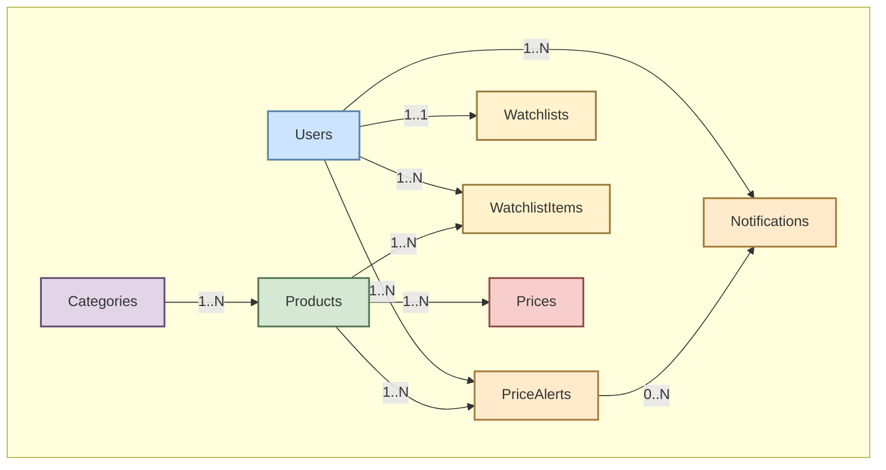

# 📦 Modelos de Dominio (`/model`)

Este directorio contiene el corazón de la lógica de negocio de la aplicación: las **entidades de dominio**. Cada archivo en este paquete define una estructura (`struct`) que representa un concepto fundamental del sistema.

Estas estructuras no solo definen los datos, sino que también incluyen las etiquetas (`tags`) de GORM que especifican cómo estos modelos se mapean a las tablas de la base de datos (nombre de la tabla, claves primarias, relaciones, etc.). Son la única capa que tiene un conocimiento detallado de la estructura de la base de datos.

---

## 🏛️ Entidades Definidas

A continuación se detallan las tablas que componen el modelo de datos, sus campos y su propósito dentro del sistema.

### 👤 Modelo: `User`
Representa a un usuario del sistema, almacenando sus credenciales, estado de verificación y preferencias.

| Campo                | Tipo    | Descripción                                      | Restricciones                     |
| :------------------- | :------ | :----------------------------------------------- | :-------------------------------- |
| `ID`                 | `uint`  | Identificador único                              | Clave Primaria                    |
| `Username`           | `string`| Nombre de usuario para mostrar                   | Único, No Nulo                    |
| `Email`              | `string`| Correo electrónico para login y notificaciones   | Único, No Nulo                    |
| `PasswordHash`       | `string`| Contraseña hasheada con bcrypt                   | No Nulo                           |
| `Verified`           | `bool`  | `true` si el usuario ha verificado su email      | `default: false`                  |
| `VerifyToken`        | `string`| Token para la verificación de email              | Opcional                          |
| `EmailNotifications` | `bool`  | `true` si el usuario desea recibir emails        | `default: true`                   |
| `IsAdmin`            | `bool`  | `true` si el usuario es administrador            | `default: false`                  |
| `CreatedAt`          | `time`  | Fecha de registro                                | Auto-generado                     |
| `UpdatedAt`          | `time`  | Fecha de última actualización                    | Auto-actualizado                  |

### 🗂️ Modelo: `Category`
Almacena las categorías temáticas de los productos (ej: "Portátiles", "Tarjetas Gráficas").

| Campo          | Tipo    | Descripción                         | Restricciones        |
| :------------- | :------ | :---------------------------------- | :------------------- |
| `ID`           | `uint`  | Identificador único                 | Clave Primaria       |
| `Name`         | `string`| Nombre de la categoría              | Único, No Nulo       |
| `Slug`         | `string`| Nombre amigable para la URL         | Único, No Nulo       |
| `ProductCount` | `int`   | Nº de productos en la categoría     | Mantenido por Triggers |
| `CreatedAt`    | `time`  | Fecha de creación                   | Auto-generado        |
| `UpdatedAt`    | `time`  | Fecha de última actualización       | Auto-actualizado     |

### 💻 Modelo: `Product`
Contiene la información consolidada de un producto, independientemente de la tienda.

| Campo          | Tipo      | Descripción                                  | Restricciones                   |
| :------------- | :-------- | :------------------------------------------- | :------------------------------ |
| `ID`           | `uint`    | Identificador único                          | Clave Primaria                  |
| `Name`         | `string`  | Nombre del producto                          | No Nulo                         |
| `Slug`         | `string`  | Nombre amigable para la URL                  | Único, No Nulo                  |
| `Description`  | `string`  | Descripción detallada del producto           | Opcional                        |
| `ImageURL`     | `string`  | Enlace a la imagen principal del producto    | Opcional                        |
| `CategoryID`   | `uint`    | Categoría a la que pertenece                 | Clave Foránea a `Categories`    |
| `ImageHash`    | `uint64`  | Hash de percepción para detectar duplicados  | Opcional, `nullable`            |
| `Specifications`| `JSON`    | Características técnicas (ej: RAM, CPU)      | Opcional                        |
| `CreatedAt`    | `time.Time`| Fecha de creación                            | Auto-generado                   |
| `UpdatedAt`    | `time.Time`| Fecha de última actualización                | Auto-actualizado                |

### 💰 Modelo: `Price`
Registra una oferta de precio específica para un `Product` en una tienda y momento concretos.

| Campo         | Tipo      | Descripción                                | Restricciones                |
| :------------ | :-------- | :----------------------------------------- | :--------------------------- |
| `ID`          | `uint`    | Identificador único                        | Clave Primaria               |
| `ProductID`   | `uint`    | Producto al que se refiere el precio       | Clave Foránea a `Products`   |
| `Store`       | `string`  | Nombre de la tienda (ej: "eBay", "Coolmod")| No Nulo                      |
| `Price`       | `float64` | Precio registrado                          | No Nulo                      |
| `Currency`    | `string`  | Moneda del precio (ej: "EUR", "USD")       | `default: 'EUR'`             |
| `URL`         | `string`  | URL directa a la oferta en la tienda       | No Nulo                      |
| `IsAvailable` | `bool`    | `true` si el producto tiene stock          | `default: true`              |
| `RetrievedAt` | `time.Time`| Fecha en que se obtuvo este precio         | No Nulo                      |
| `CreatedAt`   | `time.Time`| Fecha de creación                          | Auto-generado                |
| `UpdatedAt`   | `time.Time`| Fecha de última actualización              | Auto-actualizado             |

### 🛒 Cesta de seguimiento (`Watchlist` y `WatchlistItem`)
Modela la "Mi Cesta" del usuario, que contiene los productos que le interesan. Se compone de dos entidades: `Watchlist` (el contenedor) y `WatchlistItem` (cada producto en la cesta), este sistema esta pensado para que en un futuro el usuario pueda crear multiples listas de deseos.

**`Watchlist`**:
| Campo    | Tipo      | Descripción                           | Restricciones              |
| :------- | :-------- | :------------------------------------ | :------------------------- |
| `ID`     | `uint`    | Identificador único de la lista       | Clave Primaria             |
| `UserID` | `uint`    | Usuario propietario de la lista       | Clave Foránea a `Users`, Único |
| `Name`   | `string`  | Nombre de la lista de seguimiento     | `default: 'Mi Lista...'`   |

**`WatchlistItem`**:
| Campo         | Tipo      | Descripción                                | Restricciones                     |
| :------------ | :-------- | :----------------------------------------- | :-------------------------------- |
| `ID`          | `uint`    | Identificador único del item               | Clave Primaria                    |
| `UserID`      | `uint`    | Usuario propietario                        | Clave Foránea a `Users`           |
| `ProductID`   | `uint`    | Producto seguido                           | Clave Foránea a `Products`        |
| `TargetPrice` | `float64` | Precio objetivo para recibir una alerta    | Opcional                          |
| `Notes`       | `string`  | Notas personales sobre el producto         | Opcional                          |
| `CreatedAt`   | `time.Time`| Fecha en que se añadió el producto a la cesta | Auto-generado                     |

### 🔔 Modelo: `PriceAlert`
Define una alerta de precio activa. Aunque un `WatchlistItem` puede tener un precio objetivo, esta entidad representa una alerta más formal que es procesada por el sistema para generar notificaciones.

| Campo         | Tipo      | Descripción                                | Restricciones                  |
| :------------ | :-------- | :----------------------------------------- | :----------------------------- |
| `ID`          | `uint`    | Identificador único                        | Clave Primaria                 |
| `UserID`      | `uint`    | Usuario que crea la alerta                 | Clave Foránea a `Users`        |
| `ProductID`   | `uint`    | Producto monitorizado                      | Clave Foránea a `Products`     |
| `TargetPrice` | `float64` | Precio objetivo para la notificación       | No Nulo                        |
| `NotifyByEmail`| `bool`    | `true` si se debe enviar un email          | `default: true`                |
| `IsActive`    | `bool`    | `true` si la alerta está activa            | `default: true`                |
| `CreatedAt`   | `time.Time`| Fecha de creación                          | Auto-generado                  |
| `UpdatedAt`   | `time.Time`| Fecha de última actualización              | Auto-actualizado               |

### 📣 Modelo: `Notification`
Almacena una notificación generada para un usuario, típicamente a raíz de una `PriceAlert`.

| Campo       | Tipo      | Descripción                                | Restricciones                      |
| :---------- | :-------- | :----------------------------------------- | :--------------------------------- |
| `ID`        | `uint`    | Identificador único                        | Clave Primaria                     |
| `UserID`    | `uint`    | Usuario que recibe la notificación         | Clave Foránea a `Users`            |
| `ProductID` | `uint`    | Producto relacionado con la notificación   | Clave Foránea a `Products`         |
| `AlertID`   | `*uint`   | Alerta que originó la notificación         | Clave Foránea a `PriceAlerts`, `nullable` |
| `Title`     | `string`  | Título de la notificación                  | No Nulo                            |
| `Message`   | `string`  | Contenido del mensaje                      | No Nulo                            |
| `IsRead`    | `bool`    | `true` si el usuario ha leído el mensaje   | `default: false`                   |
| `CreatedAt` | `time.Time`| Fecha de creación                          | Auto-generado                      |

---

## 🔗 Relaciones entre Modelos

El siguiente diagrama ilustra las conexiones principales entre las entidades del dominio:

-   **`Category` ⇨ `Product`**: Una categoría agrupa a muchos productos.
-   **`Product` ⇨ `Price`**: Un producto tiene múltiples registros de precios de diferentes tiendas y fechas.
-   **`User` ⇨ `Watchlist`**: Cada usuario tiene una única lista de seguimiento (`Watchlist`).
-   **`User` & `Product` ⇨ `WatchlistItem`**: Un usuario puede añadir muchos productos a su cesta de seguimiento.
-   **`User` & `Product` ⇨ `PriceAlert`**: Un usuario puede crear múltiples alertas de precio para diferentes productos.
-   **`PriceAlert` ⇨ `Notification`**: Cuando se cumple una alerta de precio, se genera una o más notificaciones.

Estas entidades son utilizadas por todas las demás capas de la aplicación, desde la persistencia hasta los casos de uso y la presentación final en las vistas. 