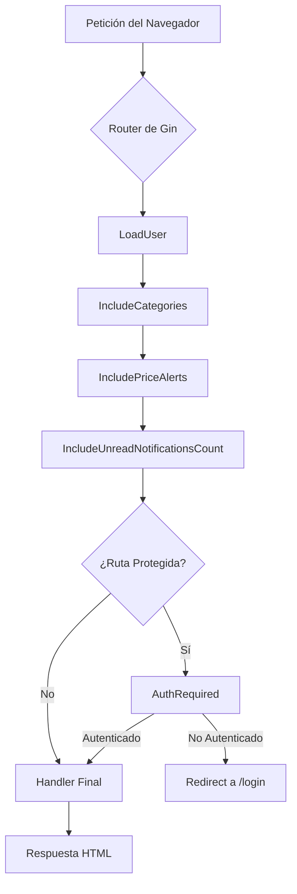

# 🛡️ Middlewares (`/middleware`)

Este directorio contiene los `middlewares` de la aplicación. En el framework Gin, un middleware es una pieza de código que se ejecuta **antes** del manejador principal de la ruta (`handler`). Son perfectos para gestionar tareas que son comunes a muchas rutas, conocidas como "preocupaciones transversales" (cross-cutting concerns).

Los middlewares pueden:
- Procesar la petición antes de que llegue al `handler`.
- Añadir datos al contexto de la petición, que estarán disponibles para los `handlers` y plantillas posteriores.
- Detener el ciclo de la petición (por ejemplo, si un usuario no está autenticado).

---

## ⛓️ Flujo de una Petición

Una petición entrante atraviesa una cadena de middlewares antes de llegar al `handler` final. Esto permite una separación de responsabilidades muy limpia.

---

## 🧩 Middlewares Implementados

### Autenticación y Carga de Usuario (`auth.go`)

Este módulo se encarga de todo lo relacionado con la seguridad y la sesión del usuario.

| Middleware | Descripción |
| :--- | :--- |
| `AuthRequired()` | Protege rutas específicas. Verifica si existe un `user_id` en la sesión. Si no existe, redirige al usuario a `/login` y aborta la petición. Se aplica al grupo de rutas `authorized`. |
| `LoadUser()` | Se ejecuta en **todas** las peticiones. Si existe un `user_id` en la sesión, carga los datos completos del usuario desde la base de datos y los inyecta en el contexto de Gin usando `c.Set("user", user)`. Esto hace que los datos del usuario estén disponibles globalmente. Si el usuario no existe o la sesión es inválida, limpia la sesión. |
| `AdminRequired()`| Es una capa de seguridad adicional sobre `AuthRequired`. Verifica que el usuario cargado por `LoadUser` tenga el flag `IsAdmin` activado. Si no, muestra una página de error de "acceso prohibido". |

### Inyección de Datos Globales

Estos middlewares tienen un propósito muy poderoso: obtener datos que son necesarios en la mayoría de las páginas (especialmente en el `layout.html`) y añadirlos al contexto. Esto evita tener que repetir esta lógica en cada `handler`.

| Middleware | Archivo | Descripción | Clave en Contexto |
| :--- | :--- | :--- | :--- |
| `IncludeCategories()` | `categories.go` | Obtiene la lista completa de categorías de productos desde la base de datos para mostrarla en el menú de navegación principal. | `allCategories` |
| `IncludePriceAlerts()`| `price_alerts.go`| Obtiene todas las alertas de precio activas para el usuario logueado. Se utiliza para mostrar el contador en el icono de "Mi Cesta". | `PriceAlerts` |
| `IncludeUnreadNotificationsCount()` | `notifications.go` | Cuenta el número de notificaciones no leídas para el usuario logueado y lo inyecta en el contexto para mostrar el badge numérico en el icono de notificaciones. | `UnreadNotifications`|

**Nota Importante:** Todos los middlewares de inyección de datos están diseñados para ser "a prueba de fallos". Si ocurre un error al obtener los datos (o si el usuario no está logueado), establecen un valor por defecto seguro (un contador a 0 o una lista vacía) en el contexto y continúan la ejecución, evitando que la aplicación se caiga. 